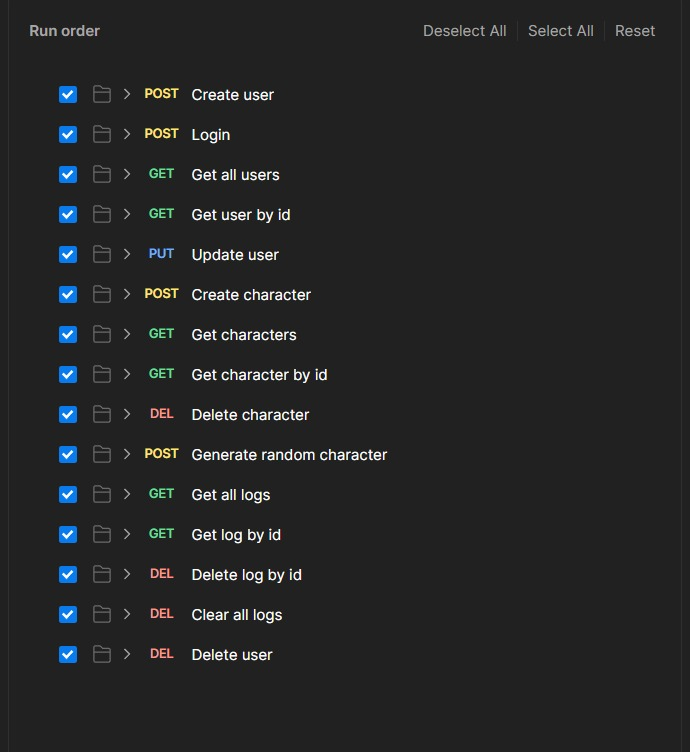

# Running the app

```bash
$ docker-compose build
$ docker-compose up
```

# Documentation
[Click here to access the full documentation.](https://documenter.getpostman.com/view/30334910/2sA3XWdycs)

# Order to run requests on POSTMAN

### The order below must be followed due to scripts created, or else, you must change manually the global variables ⚠️

